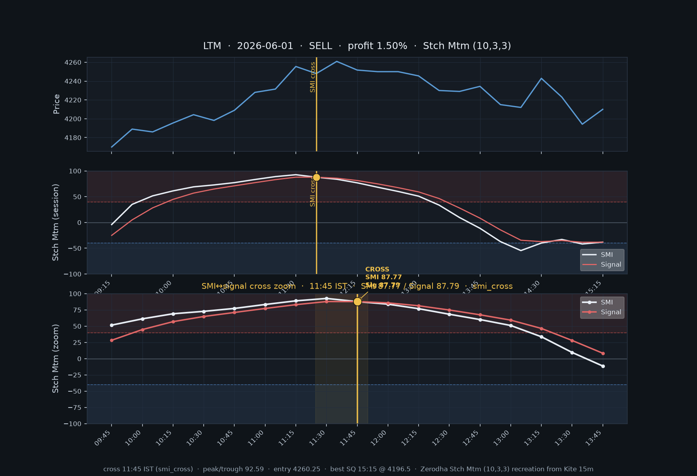
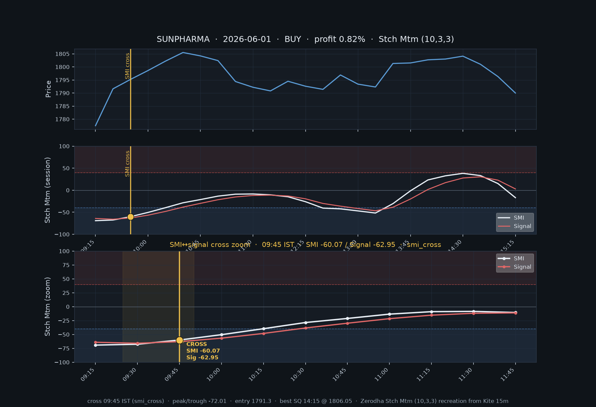
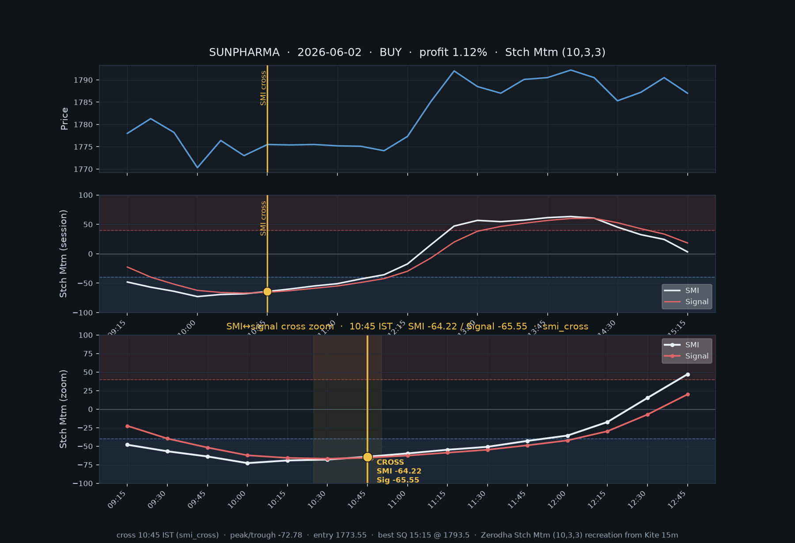
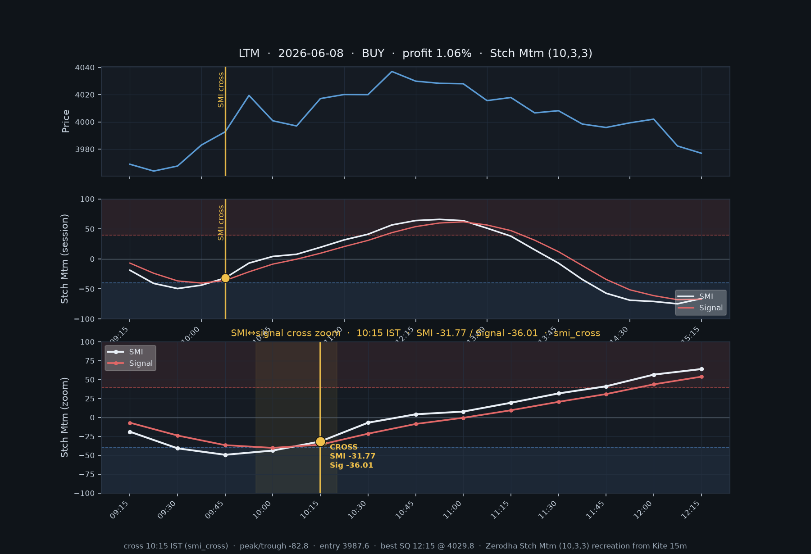
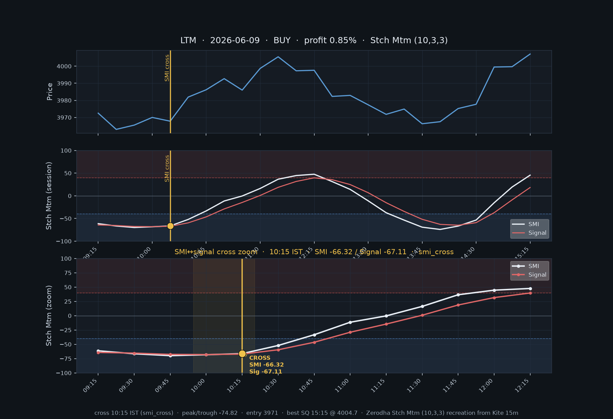
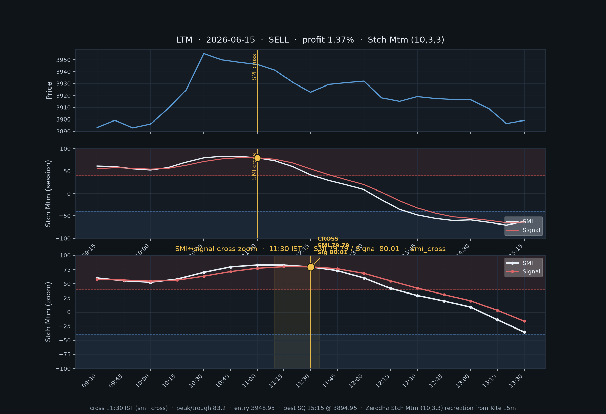

# Deeppro Stch Mtm snapshots — SUNPHARMA + LTM × 5 trade days (≥ 0.75%)

- **Stocks:** SUNPHARMA, LTM
- **Trade days:** 2026-06-01, 2026-06-02, 2026-06-08, 2026-06-09, 2026-06-15
- **Rule:** deeppro SMI↔signal cross only (`signalOnSmiCrossOnly`)
- **Hit:** best same-day SQ mid before 15:15 IST ≥ 0.75%
- **Hits:** 6
- **Charts:** Zerodha **Stch Mtm (10,3,3)** recreation from Kite 15m — gold marker = exact SMI↔signal cross

## Hits

| Stock | Date | Side | Cross IST | Kind | Cross SMI / Signal | Peak/Trough | Entry | Best SQ | Profit % | Chart |
|-------|------|------|-----------|------|--------------------|-------------|-------|---------|----------|-------|
| LTM | 2026-06-01 | SELL | 11:45 | smi_cross | 87.77 / 87.79 | 92.59 | 4260.25 | 15:15 | 1.50% | `LTM_2026-06-01_SELL_1145.png` |
| SUNPHARMA | 2026-06-01 | BUY | 09:45 | smi_cross | -60.07 / -62.95 | -72.01 | 1791.30 | 14:15 | 0.82% | `SUNPHARMA_2026-06-01_BUY_0945.png` |
| SUNPHARMA | 2026-06-02 | BUY | 10:45 | smi_cross | -64.22 / -65.55 | -72.78 | 1773.55 | 15:15 | 1.12% | `SUNPHARMA_2026-06-02_BUY_1045.png` |
| LTM | 2026-06-08 | BUY | 10:15 | smi_cross | -31.77 / -36.01 | -82.8 | 3987.60 | 12:15 | 1.06% | `LTM_2026-06-08_BUY_1015.png` |
| LTM | 2026-06-09 | BUY | 10:15 | smi_cross | -66.32 / -67.11 | -74.82 | 3971.00 | 15:15 | 0.85% | `LTM_2026-06-09_BUY_1015.png` |
| LTM | 2026-06-15 | SELL | 11:30 | smi_cross | 79.79 / 80.01 | 83.2 | 3948.95 | 15:15 | 1.37% | `LTM_2026-06-15_SELL_1130.png` |

## Stch Mtm cross snapshots

Each chart: price (top) · full-session Stch Mtm (middle) · **±8-bar zoom on the SMI↔signal cross** (bottom). White = SMI, red = signal, gold = Deeppro entry.

### LTM · 2026-06-01 · SELL @ 11:45 (1.50%)

### SUNPHARMA · 2026-06-01 · BUY @ 09:45 (0.82%)

### SUNPHARMA · 2026-06-02 · BUY @ 10:45 (1.12%)

### LTM · 2026-06-08 · BUY @ 10:15 (1.06%)

### LTM · 2026-06-09 · BUY @ 10:15 (0.85%)

### LTM · 2026-06-15 · SELL @ 11:30 (1.37%)

## How to read the Stch Mtm snapshot

- Formula matches Zerodha **Stch Mtm (10, 3, 3)** (William Blau SMI) on Kite 15m candles
- **White** = SMI · **Red** = signal line
- Vertical **gold** line + marker = exact SMI↔signal cross (the Deeppro BUY/SELL entry)
- Bottom panel zooms ±8 bars around the cross so the line intersection is clear
- Shaded zone ≈ overbought (≥40) / oversold (≤-40)
