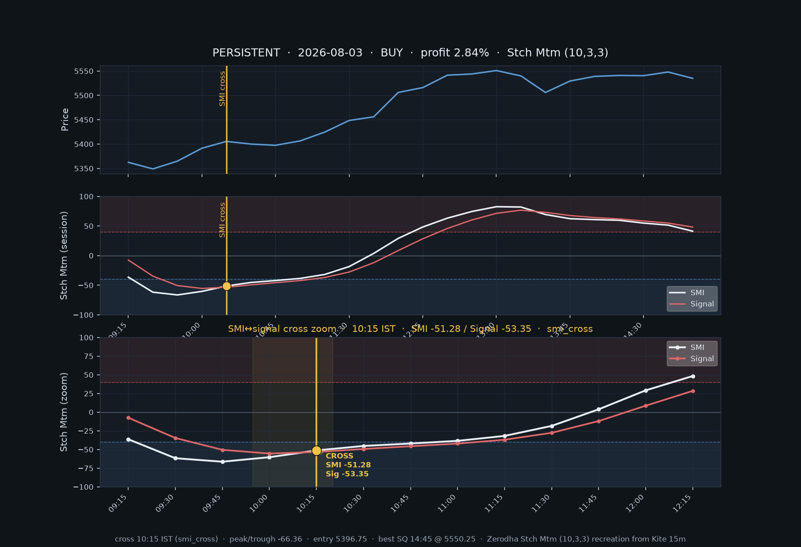
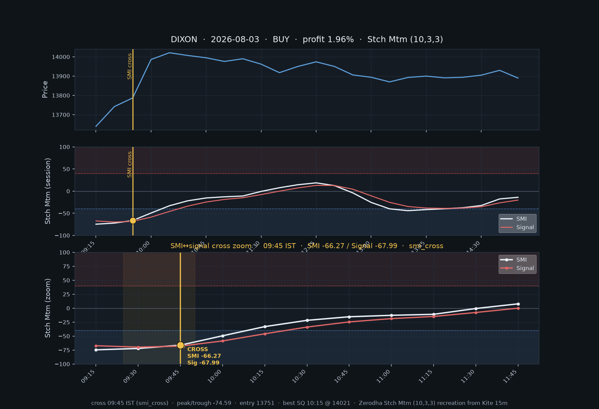
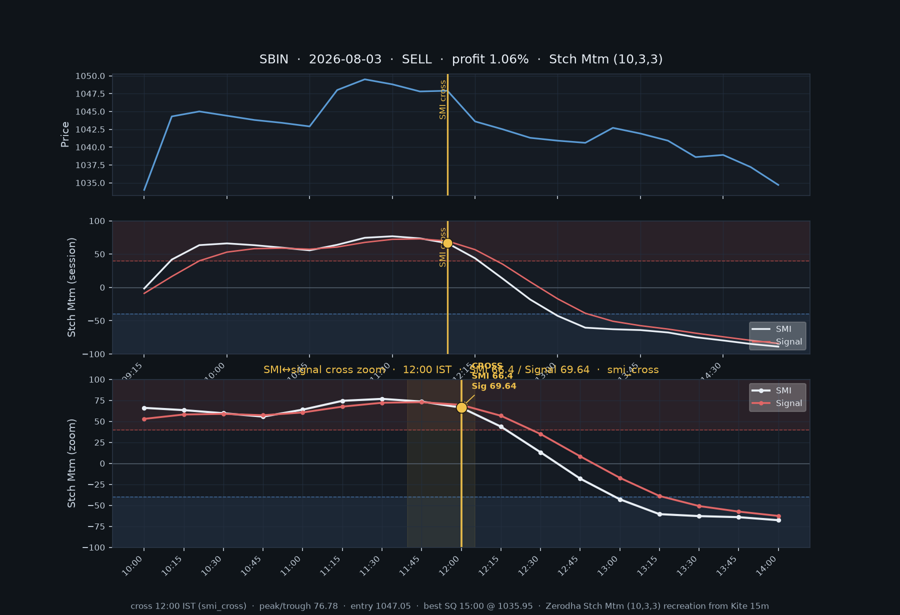

# Deeppro Stch Mtm snapshots — 50 stocks · 3 Aug (≥ 0.75%)

- **Date:** 2026-08-03
- **Universe:** first 50 SECTOR_WATCHLIST stocks
- **Rule:** deeppro SMI↔signal cross only (`signalOnSmiCrossOnly`)
- **Hit:** best same-day SQ mid before 15:15 IST ≥ 0.75%
- **Stocks scanned:** 50 · with signals: 19 · in report: 3
- **Hits:** 3 (1 SELL · 2 BUY)
- **Fetch errors:** 0
- **Charts:** Zerodha **Stch Mtm (10,3,3)** recreation from Kite 15m — gold marker = exact SMI↔signal cross
- **Generated (UTC):** 2026-08-03T13:17:48.412Z

## Hits

| Stock | Sector | Side | Cross IST | Kind | Cross SMI / Signal | Peak/Trough | Entry | Best SQ | Profit % | Chart |
|-------|--------|------|-----------|------|--------------------|-------------|-------|---------|----------|-------|
| PERSISTENT | IT | BUY | 10:15 | smi_cross | -51.28 / -53.35 | -66.36 | 5396.75 | 14:45 | 2.84% | `PERSISTENT_2026-08-03_BUY_1015.png` |
| DIXON | IT | BUY | 09:45 | smi_cross | -66.27 / -67.99 | -74.59 | 13751.00 | 10:15 | 1.96% | `DIXON_2026-08-03_BUY_0945.png` |
| SBIN | Bank | SELL | 12:00 | smi_cross | 66.4 / 69.64 | 76.78 | 1047.05 | 15:00 | 1.06% | `SBIN_2026-08-03_SELL_1200.png` |

## Stch Mtm cross snapshots

Each chart: price (top) · full-session Stch Mtm (middle) · **±8-bar zoom on the SMI↔signal cross** (bottom). White = SMI, red = signal, gold = Deeppro entry.

### PERSISTENT · 2026-08-03 · BUY @ 10:15 (2.84%)

### DIXON · 2026-08-03 · BUY @ 09:45 (1.96%)

### SBIN · 2026-08-03 · SELL @ 12:00 (1.06%)

## How to read the Stch Mtm snapshot

- Formula matches Zerodha **Stch Mtm (10, 3, 3)** (William Blau SMI) on Kite 15m candles
- **White** = SMI · **Red** = signal line
- Vertical **gold** line + marker = exact SMI↔signal cross (the Deeppro BUY/SELL entry)
- Bottom panel zooms ±8 bars around the cross so the line intersection is clear
- Shaded zone ≈ overbought (≥40) / oversold (≤-40)

